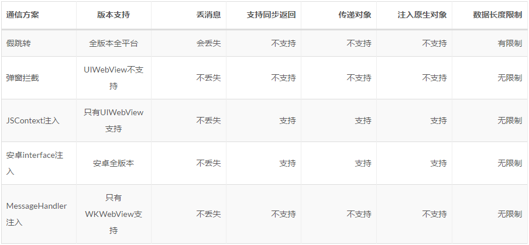
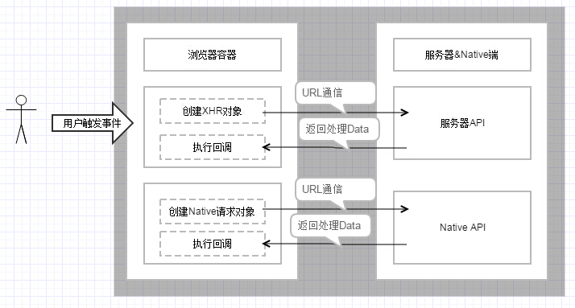
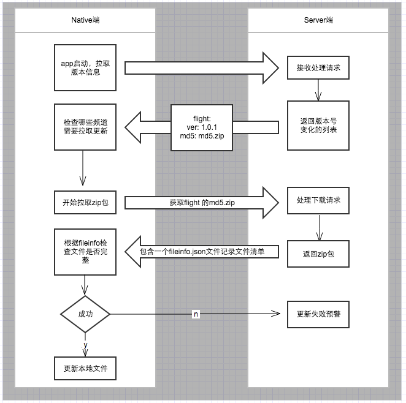

## 几种开发模式
目前对于移动端的开发主要有：
- native开发

    优点：原生体验好、渲染快、支持离线。

    缺点：不支持跨平台复用性差、开发周期长、可能会占用较多手机内存。
- web开发

    优点：不占用手机内存、迭代快、代码可复用支持跨平台。

    缺点：体验差、依赖网络。
- Hybrid混合开发

    针对Hybrid来说，它继承了原生开发和web开发各自的优点，对于交互要求比较强且变更迭代不频繁的应用，可使用原生开发；而对于一些展示性的或者新闻性页面，对交互要求不强及需要快速更新的，可使用H5页面来开发，并且这些页面可减少native资源包过大的问题，同时解决了跨平台问题，代码可多端复用，降低人力成本。而Hybrid开发使用内置的WebView来实现内嵌网页，有点类似于iframe。
- 其他方案
    
    react-native、weex、flutter等

    UI组件及交互是原生实现，而底层逻辑通过js来实现。继承了原生体验性能好，以及底层代码可复用快速部署的各项优点。目前技术暂时还不成熟。
    

## H5与Native的通信jsBridge的实现方案
### javascriptInterface(安卓)) / javascriptCore(iOS UIWebview) / scriptMessageHandler(iOS8 WKWebView)
```
public class JavascriptInterface {

    @JavascriptInterface
    public void test(String str) {
        // ....
    }
}
```
该方法会绑定在js的window下面，js直接调用即可。相应的js可以通过观察者模式事先将一些方法注册到window下面，Native同样可以通过该方式直接调用js的方法。

对于iOS的话该方法只支持iOS7+。

对于安卓系统在4.2之前的，存在严重的注入漏洞，该漏洞源于程序没有正确限制使用WebView.addJavascriptInterface方法，远程攻击者可通过使用Java Reflection API利用该漏洞执行任意Java对象的方法，简单的说就是通过addJavascriptInterface给WebView加入一个JavaScript桥接接口，JavaScript通过调用这个接口可以直接操作本地的JAVA接口。
### 改写浏览器原有对象：alert/console/prompt
- alert，可以被webview的onJsAlert监听
- confirm，可以被webview的onJsConfirm监听
- console.log，可以被webview的onConsoleMessage监听
- prompt，可以被webview的onJsPrompt监听

prompt简单举例说明，Web页面通过调用prompt()方法，安卓客户端通过监听onJsPrompt事件，拦截传入的参数，如果参数符合一定协议规范，那么就解析参数，扔给后续的Java去处理。

### URL scheme
类似于上条，同样是通过一种协议规范，将要调用的方法、参数以及回调以URL scheme传递给Native，实现假跳转的请求拦截。




## 资源加载
一种方式是利用WebView的本地缓存，但这种方式不稳定，无法控制何时失效。具体实现可以在打开APP或处理资源闲置时，打开一个隐藏的WebView，然后预先加载重要的资源，之后再打开时就可以利用WebView的缓存了。

还有一种方式是客户端拦截资源请求。先访问本地的静态资源查看版本号，如果有更新则直接请求服务器，没有的话再检查是否有本地的离线文件，如果该文件已经下载，则直接从离线文件中提取。


## 鉴权
一般采用的认证机制是cookie或者token认证，在纯web工程中采用两种方式均是可以的，在Hybrid混合开发中，由于是基于WebView的，也可以使用cookie来实现验证。在安卓WebView和iOS的UIWebView中都可以采用这种方式，但是在iOS的WKWebView中，由于WKWebview的网络请求是系统进程，所以无法监听前端到的ajax，也就是说，不能在ajax中注入cookie。所以最好采用token方式。